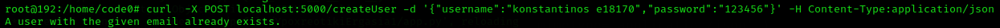
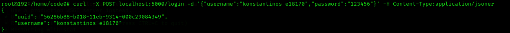
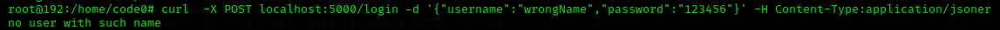
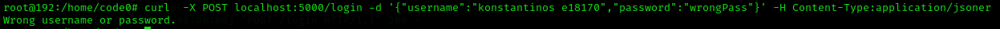
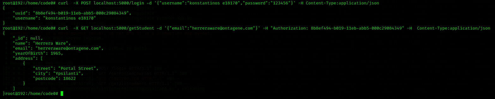
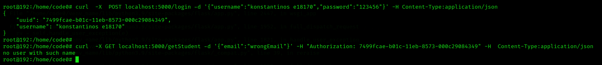
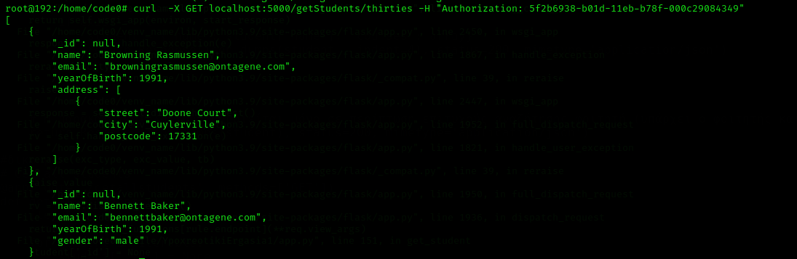
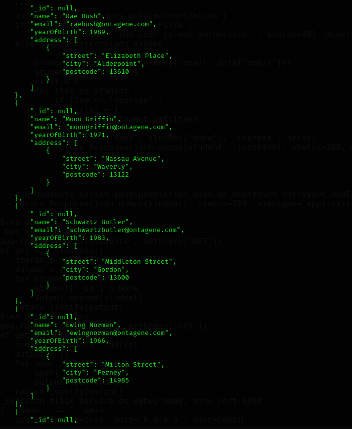
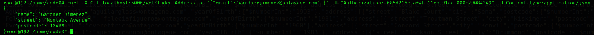
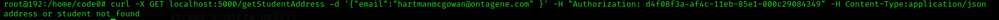

# Ergasia_1_E18170_Tsoutsis_Konstantinos
<h1>Endpoint 1, Create user </h1>

Για να κάνουμε εισαγωγή χρήστη στην βάση δεδομένων αρχικά κάνουμε αναζήτηση για το αν υπάρχει ήδη κάποιος με το ίδιο username. Η αναζήτηση αυτή γίνεται με την συνάρτηση count. Αν υπάρχει χρήστης με το ίδιο username τοτε επιστρέφεται μήνυμα λάθος με status = 400 .
Αν δεν υπάρχει χρήστης με το username αυτο τοτε γίνεται κανονικα η εισαγωγη και επιστρέφεται μήνυμα επιτυχίας με status = 200.
Στα screenshots βλέπουμε πως κάνουμε πρώτα εγγραφη ενός χρήστη όπου το username του δεν υπάρχει στην βάση και έτσι γίνεται κανονικα η εισαγώγη και έπειτα προσπαθουμε να ξανα εισάγουμε χρήστη με το ιδιο όνομα, αυτη η ενέργεια μας επιστρεφει μήνυμα ότι ο χρήστης υπάρχει ήδη .     

  
<h1>Endpoint 2 , Login user </h1>

Για να πραγματοποιηθεί σύνδεση χρήστη πρέπει ο χρήστης να δηλώσει το username και το password του. Αν αυτά αντιστοιχούν με τα δεδομένα που υπάρχουν στην βαση τότε καλούμε την συνάρτηση create_session όπου παράγει το uuid της σύνδεσης. Έπειτα αν η σύνδεση πραγματοποιηθεί εμφανίζουμε μήνυμα επιτυχίας καθως και τα στοιχεία username-uuid. Αντίστοιχα αν δεν μπορει να πραγματοποιηθεί σύνδεση είτε γιατι δεν είναι σωστό το username είτε γιατί δεν είναι σωστό το password εμφανίζουμε μήνυμα αποτυχιας.  
<b>ΕΠΙΤΥΧΗΜΕΝΗ ΣΥΝΔΕΣΗ</b>  <b>ΛΑΘΟΣ USERNAME</b>  <b>ΛΑΘΟΣ PASSWORD</b>

  
<h1>Endpoint 3 , Get student information by Email </h1>

Για να πάρουμε πληροφορίες ενος μαθητή απο το email του αρχικά πρέπει να γίνει συνδεση χρήστη και να δωθει στα headeres το uuid. Για να διαπιστώσουμε αν το uuid είναι σωστό καλούμε την συνάρτηση is_session_valid. Αμα η συνάρτηση είναι false τοτε επιστρέφει μήνυμα αποτυχίας με statous = 401. Διαφορετικά, γίνεται ανάζητηση του μαθητή βαση email. Αν υπάρχει ο μαθητής επιστρέφονται σε μήνυμα τα στοιχεία του , αλλιως ενα μήνυμα αποτυχίας    
<b>ΕΠΙΤΥΧΗΜΕΝΗ ΑΝΑΖΗΤΗΣΗ</b>  <b>ΑΠΟΤΥΧΗΜΕΝΗ ΑΝΑΖΗΤΗΣΗ</b> 

  
<h1>Endpoint 4 , Get students in age of thirties </h1>

Για να βρούμε τους φοιτητές με ηλικία 30 χρονών κάνουμε ξανα την διαδικασια αυθεντικοποίησης. Αν γίνει σωστα η αυθεντικοποίηση τοτε ο χρήστης μπορεί να κάνει αναζήτηση βάση του ετος γέννησης που ειναι το 1991. Αμα υπάρχουν φοιτητές σε εκείνη την ηλικία τα στοιχεία τους εισάγωνται στην λίστα out και ύστερα εκτυπώνονται. Διαφορετικά, εμφανίζεται μήνυμα λάθους.  
<b>ΦΟΙΤΗΤΕΣ ΜΕ ΗΛΙΚΙΑ 30 ΕΤΗ</b>  

  
<h1>Endpoint 5 , Get students over thirties </h1>

Για να βρούμε τους φοιτητές με ηλικία μεγαλύτερη απο 30 χρονών κάνουμε ξανα την διαδικασια αυθεντικοποίησης. Αν γίνει σωστα η αυθεντικοποίηση τοτε ο χρήστης μπορεί να κάνει αναζήτηση βάση του ετος γέννησης που πρέπει να ειναι μεγαλύτερο απο το 1991.Αμα υπάρχουν φοιτητές σε εκείνη την ηλικία τα στοιχεία τους εισάγωνται στην λίστα out και ύστερα εκτυπώνονται. Διαφορετικά, εμφανίζεται μήνυμα λάθους.  
<b>ΦΟΙΤΗΤΕΣ ΜΕ ΗΛΙΚΙΑ ΜΕΓΑΛΥΤΕΡΗ ΑΠΟ 30 ΕΤΗ</b>
  *Λογω χωρου δεν εμφανίζονται όλα τα αποτελέσματα*  

  
<h1>Endpoint 6 , Get students address </h1>

Για να βρούμε τους φοιτητές όπου έχουν δηλώσει κατοικία κάνουμε ξανα την διαδικασία αυθεντικοποίησης. Αν γίνει σωστα η αυθεντικοποίηση τοτε ο χρήστης μπορεί να κάνει αναζήτηση βάση του email του φοιτητή. Αρχικά αναζητούμε αν υπάρχει ο χρήστης και έχει δηλωμένη διέυθυνση. Αν δεν υπάρχει εμφανίζουμε μήνυμα λάθους, αν υπάρχει τότε επιστρέφονται το όνομα του και τα στοιχεία κατοικίας. Για να βρόυμε αυτά τα στοιχεία κάνουμε αναζήτηση μεσα στο dictionary της διεύθυνσης και επιλεγουμε τα στοιχεία 'street' και 'post code'.  ΕΠΙΤΥΧΗΜΕΝΗ ΕΜΦΑΝΙΣΗ ΣΤΟΙΧΕΙΩΝ ΚΑΤΟΙΚΙΑΣ  
ΑΠΟΤΥΧΗΜΕΝΗ ΕΜΦΑΝΙΣΗ ΣΤΟΙΧΕΙΩΝ ΚΑΤΟΙΚΙΑΣ

  
<h1>Endpoint 7 , Delete student </h1>

Για να διγραφεί ένας φοιτητης αρχικά κάνουμε αυθεντικοποίηση. Αν γίνει σωστά τότε αναζητάμε τον φοιτητή βάση email. Αν υπάρχει ο φοιτητής τον διαγράφουμε και εμφανιζόυμε κατάλληλο μήνυμα για την επιιτυχή διαγραφή μαζι με το όνομα του φοιτητή που διαγράψαμε. Αλλιώς άν δεν υπάρχει φοιτητης με το email που δωσαμε εμφανιζουμε αντίστοιχο μήνυμα. 
Στο παρακάτω screenshot βλέπουμε πως την πρώτη φορα που προσπαθούμε να διαγράψουμε τον φοιτητή μας επιστρεφει μήνυμα επιτυχίας ενώ άμα προσπαθήσουμε να κξανα διαγραψουμε τον φοιτητή μας επιστρέφει μήνυμα λάθους.  
  
